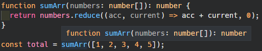

# 1. 타입스크립트 연습

> _References_ <br> <a href="https://react.vlpt.us/using-typescript/01-practice.html">"01. 타입스크립트 연습"</a> _.velopert_ <br> <a href="https://hyunseob.github.io/2017/01/14/typescript-generic/">"TypeScript: 제네릭(Generic)"</a> _.HyunSeob_

## 📕 주로 배운 내용

- ### 기본 타입

  - 변수나 상수에 **정적 타입**을 지정해줄 수 있다. 만약 지정한 타입이 아닐 경우 오류가 발생한다.

    ```typescript
    const message: string = "hello world";
    const num: number = 1;
    const isDone: boolean = true;
    ```

  - 배열의 경우, 타입명에 대괄호를 써주면 된다.

    ```typescript
    const nums: number[] = [1, 2, 3];
    const messages: string[] = ["hello", "world"];
    ```

  - 변수나 상수에 들어갈 수 있는 **값을 지정**할 수도 있다.

    ```typescript
    const color: "red" | "orange" | "yellow" = "red";
    color = "green"; // 에러
    ```

    ```typescript
    // 값이 null이거나 숫자이거나 둘 중 하나
    const nullableNumber: number | null = null;
    ```

  - 변수나 상수에 **초기화 시 지정해 준 값의 타입과 다른 타입의 값을 지정**할 경우 오류가 발생한다.

    ```typescript
    let count = 0;
    count = "hello world"; // 에러
    ```

- ### 함수에서 타입 정의

  - **파라미터 값의 타입**과 **리턴 값의 타입**을 지정할 수 있다.

    ```typescript
    function sum(x: number, y: number): number {
      return x + y;
    }

    sum(1, 2);
    ```

    ```typescript
    function sumArr(numbers: number[]): number {
      return numbers.reduce((acc, current) => acc + current, 0);
    }

    console.log(sumArr([1, 2, 3, 4, 5]));
    ```

    👉 코딩 중에 파라미터로 어떤 타입의 값을 넣어야 할지 알 수 있다.<br>
    

- ### interface

  - **클래스 혹은 객체의 타입을 지정**할 때 사용된다.
    👉 보통 클래스에서 많이 쓰이며, 객체는 Type Alias를 사용하는 편이다.
  - **클래스**에서 interface를 implements하기

    ```javascript
    interface Shape {
      // Shape 인터페이스에는 숫자값을 반환하는 getArea 함수가 꼭 있어야 한다.
      getArea(): number;
    }

    // implements : 인터페이스의 조건을 충족하겠음을 명시함
    class Circle implements Shape {
      radius: number;

      constructor(radius: number) {
        this.radius = radius;
      }

      getArea() {
        return this.radius * this.radius * Math.PI;
      }
    }

    class Rectangle implements Shape {
      // 생성자의 인자에 접근자(private, public)을 추가하면 별도의 변수 선언 과정을 생략할 수 있다.
      constructor(private width: number, private height: number) {
        this.width = width;
        this.height = height;
      }

      getArea() {
        return this.width * this.height;
      }
    }

    const shapes: Shape[] = [Circle(5), Rectangle(10, 5)];

    shapes.forEach((shape) => {
      console.log(shape.getArea());
    })
    ```

    출력 결과

    ```bash
    78.53981633974483
    50
    ```

  - **일반 객체**의 타입을 interface로 설정하기

    ```javascript
    interface Person {
      name: string;
      // ? = 설정을 해도 되고 안해도 된다는 의미
      age?: number;
    }

    // Person 객체를 상속해주었다.
    interface Developer extends Person {
      skills: string[];
    }

    const person: Person = {
      name: "흑괴",
      age: 20,
    };

    const expert: Developer = {
      name: "백괴",
      skills: ["React", "JavaScript"],
    };

    const people: Person[] = [person, expert];
    ```

- ### Type Alias

  - 특정 타입에 **별칭을 붙이는 용도**로 사용된다.
  - **객체를 위한 타입**을 설정해 줄 수도 있다.

    ```typescript
    type Person = {
      name: string;
      age?: number;
    };

    // & = 인터섹션으로서, 여러개의 타입들을 합쳐줌
    type Developer = Person & {
      skills: string[];
    };

    const person: Person = {
      name: "흑괴",
      age: 20,
    };

    const expert: Developer = {
      name: "백괴",
      skills: ["React", "JavaScript"],
    };

    // 'People 타입 = Person 타입의 값이 들어가는 배열'로 설정되었음
    type People = Person[];
    const people: People = [person, expert];

    // 'Color 타입 = 문자열 아래 3개만 들어갈 수 있음'으로 설정되었음
    type Color = "red" | "orange" | "yellow";
    const color: Color = "red";

    // 위에서 생성한 타입 Color의 배열을 타입으로 지정
    const colors: Color[] = ["orange", "yellow"];
    ```

- ### Generic

  - 선언 시점이 아닌 **생성 시점에 타입을 명시**하여 다양한 타입을 사용할 수 있도록 한다.
    <br>👉 **특정 타입에 한정짓지 않고 범용적으로 재사용**할 수 있다.
  - 함수, 클래스, 인터페이스, 타입 Alias를 모두 지원한다.
  - **함수**에 Generic 사용하기

    ```typescript
    function getFirstVal<T>(arr: T[]): T {
      return arr[0];
    }

    // number 타입 배열이 들어가는 getFirstVal()
    console.log(getFirstVal<number>([1, 2, 3, 4]));
    // string 타입 배열이 들어가는 getFirstVal()
    console.log(getFirstVal<string>(["hello", "world"]));
    ```

  - **클래스**에 Generic 사용하기

    ```typescript
    class Stack<T> {
      data: T[] = [];

      constructor() {}

      push(item: T): void {
        this.data.push(item);
      }

      pop(): T {
        return this.data.pop();
      }
    }

    // number 타입이 들어가는 스택
    const numberStack = new Stack<number>();
    // string 타입이 들어가는 스택
    const stringStack = new Stack<string>();

    numberStack.push(1);
    stringStack.push("a");
    ```

  - 범용 타입을 사용하기 위해서는 `any`를 사용하는 방법도 있으나, 이는 **타입 유추**를 깨뜨린다.
    <br>👉 자바스크립트의 그것과 같은 상태라고 할 수 있다.

    ```typescript
    class Stack {
      data: any[] = [];

      constructor() {}

      push(item: any): void {
        this.data.push(item);
      }

      pop(): any {
        return this.data.pop();
      }
    }

    const stack = new Stack();
    stack.push(1);
    stack.push("a");
    stack.pop.substring(); // a
    stack.pop.substring(); // TypeError
    ```
