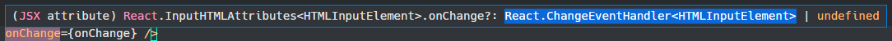

# 3. 타입스크립트로 리액트 상태 관리하기

> _References_ <br> <a href="https://react.vlpt.us/using-typescript/03-ts-manage-state.html">"3. 타입스크립트로 리액트 상태 관리하기"</a> _.velopert_

## 📕 주로 배운 내용

- ### useState × Generic

  - **useState**를 사용할 때, **Generic**을 통해 어떤 타입이 올 지 정해줄 수 있다.

    ```typescript
    // 숫자만 올 수 있도록 설정
    const [count, setCount] = useState<number>(0);

    // string 혹은 null만 오도록 설정
    const [company, setCompany] = useState<string | null>(null);
    ```

  - Generic을 사용하지 않더라도 자동으로 타입 유추를 하기 때문에, Generic은 생략할 수 있다.

- ### 이벤트 객체의 타입 알아내기

  - 이벤트 객체 `e`의 타입의 경우, **태그의 이벤트 핸들러**에 마우스를 갖다 댈 경우 알아낼 수 있다. <br>
    👉 아래 사진의 `onChange` 이벤트 같은 경우 `React.changeEvent<HTMLInputElement>`가 이벤트 객체 타입에 해당한다. (절대 `React.changeEventHandler<HTMLInputElement>`가 아니다!!) <br>
    

  - 예시로 input 객체의 상태를 관리할 경우, input 태그의 `onChange`와 form 태그의 `onSubmit`의 타입을 알아내면 될 것이다.

    ```typescript
    const onChange = (e: React.ChangeEvent<HTMLInputElement>) => {...};

    const handleSubmit = (e: React.FormEvent<HTMLFormElement>) => {...};

    return (
      <form onSubmit={handleSubmit}>
        <input name="name" value={name} onChange={onChange} />
        <input name="description" value={description} onChange={onChange} />
        <button type="submit">등록</button>
      </form>
    );
    ```

- ### useReducer 사용하기

  - **type Alias**와 **Interface**를 통해 **액션 객체로 들어올 수 있는 값/타입** 및 **리듀서의 상태로 들어올 수 있는 값/타입**을 미리 정할 수 있다.

    ```typescript
    // 액션 객체로 들어올 수 있는 타입과, 각 타입 별 변경이 일어나는 key를 정해주었다.
    // 다른 타입의 객체가 들어옴으로 인한 에러를 원천 차단한다.
    type Action =
      | { type: "SET_COUNT"; count: number }
      | { type: "SET_TEXT"; text: string }
      | { type: "SET_COLOR"; color: Color }
      | { type: "TOGGLE_GOOD" };

    // 리듀서 상태의 각 key 값으로 들어올 수 있는 타입을 정해주었다.
    type State = {
      count: number;
      text: string;
      color: Color;
      isGood: boolean
    }

    ...

    const reducer = (state: State, action: Action): State => {...}
    ```
